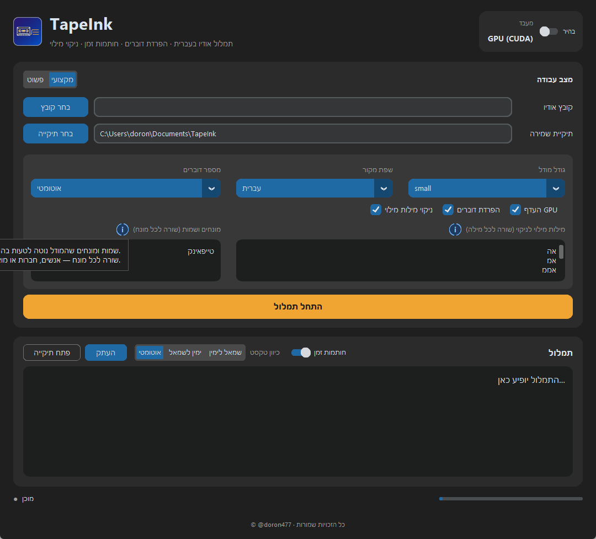

<div dir="rtl" align="right">

# TapeInk

כלי דסקטופ לתמלול אודיו בעברית — עם **הפרדת דוברים**, **חותמות זמן** ו**ניקוי מילות מילוי**.
הכול רץ מקומית על המחשב, ללא שליחת אודיו לאינטרנט וללא מסד נתונים.



## תכונות

- תמלול עברית (ואנגלית) באיכות גבוהה באמצעות Whisper
- הפרדת דוברים אוטומטית (`דובר 1`, `דובר 2`, …)
- חותמות זמן לכל קטע
- ניקוי מילות מילוי בעברית (אה, אממ, כאילו, יעני…) עם רשימה שניתן לערוך
- שני מצבי עבודה: **פשוט** (לחיצה אחת) ו**מקצועי** (שליטה מלאה)
- בורר כיוון טקסט: RTL לעברית, LTR לאנגלית, או אוטומטי
- שמירה מקומית ל־`TXT`, `SRT`, `JSON`
- מזהה GPU אוטומטית, ועובד גם ללא כרטיס גרפי

## דרישות מערכת

- Windows 10 / 11 (64 ביט)
- כ־3 GB שטח פנוי (Python, ספריות ומודל)
- כרטיס NVIDIA — **אופציונלי**. מאיץ את התמלול; בלעדיו העבודה מתבצעת על המעבד

---

## התקנה מהירה (מומלץ)

**שני צעדים, בלי ידע טכני:**

1. הורידו את הפרויקט: בדף ה־GitHub לחצו על **Code → Download ZIP**, ואז
   לחצו ימני על הקובץ שהורד → **Extract All** (חילוץ).
2. בתיקייה שנחלצה, לחצו לחיצה כפולה על **`Install-TapeInk.bat`**.

זה הכול. סקריפט ההתקנה עושה את כל השאר לבד:

- מתקין Python ו־ffmpeg אם הם חסרים
- יוצר סביבת עבודה ומתקין את כל הספריות
- מזהה כרטיס NVIDIA ומתקין תמיכת GPU רק אם צריך
- מוריד את מודל התמלול
- יוצר קיצור דרך **TapeInk** על שולחן העבודה

ההתקנה לוקחת בין 5 ל־15 דקות, תלוי במהירות האינטרנט. בסיום פשוט לוחצים
על האייקון שעל שולחן העבודה.

> אם Windows מציג אזהרת SmartScreen: **More info → Run anyway**.
> זה קורה לכל קובץ שהורד מהאינטרנט וללא חתימה דיגיטלית.

---

## התקנה ידנית (למתקדמים)

מי שמעדיף לשלוט בכל שלב:

### שלב 1 — התקנת Python ו־ffmpeg

פתחו **PowerShell** והריצו:

</div>

```powershell
winget install --id Python.Python.3.12 -e --accept-source-agreements --accept-package-agreements
winget install --id Gyan.FFmpeg -e --accept-source-agreements --accept-package-agreements
```

<div dir="rtl" align="right">

לאחר ההתקנה **סגרו ופתחו מחדש את PowerShell**, כדי שהנתיבים יתעדכנו. בדיקה:

</div>

```powershell
python --version
ffmpeg -version
```

<div dir="rtl" align="right">

### שלב 2 — הורדת הפרויקט

</div>

```powershell
git clone https://github.com/doron477/TapeInk.git
cd TapeInk
```

<div dir="rtl" align="right">

אם אין `git` במחשב, אפשר להוריד ZIP מדף הפרויקט ב־GitHub ולחלץ אותו.

### שלב 3 — יצירת סביבה והתקנת ספריות

</div>

```powershell
python -m venv .venv
.\.venv\Scripts\Activate.ps1
pip install -r requirements.txt

# רק אם יש כרטיס NVIDIA - להאצת התמלול
pip install -r requirements-gpu.txt
```

<div dir="rtl" align="right">

אם PowerShell חוסם הפעלת סקריפטים, הריצו פעם אחת:

</div>

```powershell
Set-ExecutionPolicy -Scope CurrentUser RemoteSigned
```

<div dir="rtl" align="right">

### שלב 4 — יצירת קיצור דרך עם אייקון

</div>

```powershell
.\.venv\Scripts\python.exe make_shortcut.py --desktop
```

<div dir="rtl" align="right">

נוצר `TapeInk.lnk` בתיקיית הפרויקט וגם על שולחן העבודה.

### שלב 5 — הרצה

לחיצה כפולה על **TapeInk.lnk**. האפליקציה נפתחת ללא חלון CMD.

בהפעלה הראשונה יורד מודל התמלול (חיבור לאינטרנט נדרש פעם אחת בלבד).
מכאן והלאה הכול עובד מקומית, גם בלי אינטרנט.

---

## שימוש

1. בחרו **קובץ אודיו** (`mp3`, `wav`, `m4a`, `flac`, `ogg` ועוד)
2. בחרו **תיקיית שמירה**
3. לחצו **התחל תמלול**

התמלול יופיע במסך ויישמר בשלושה פורמטים:

| פורמט | שימוש |
|--------|--------|
| `TXT` | טקסט לקריאה ולעריכה |
| `SRT` | כתוביות לווידאו |
| `JSON` | נתונים מלאים כולל זמנים ברמת מילה |

### מצב פשוט לעומת מצב מקצועי

</div>

| | פשוט | מקצועי |
|---|---|---|
| מודל | `small` (מאוזן) | `tiny` עד `large-v3` |
| שפה | עברית | עברית / אנגלית / זיהוי אוטומטי |
| מספר דוברים | אוטומטי | ידני (1–6) |
| הפרדת דוברים | תמיד | ניתן לכבות |
| ניקוי מילות מילוי | תמיד | ניתן לכבות ולערוך רשימה |
| חותמות זמן | תמיד | ניתן לכבות |

<div dir="rtl" align="right">

## כיוון טקסט (RTL / LTR)

בסרגל התמלול יש בורר **כיוון טקסט**:

- **אוטומטי** — עברית מיושרת לימין, אנגלית לשמאל
- **ימין לשמאל** / **שמאל לימין** — כפייה ידנית

בתצוגה בעברית חותמת הזמן מופיעה בסוף השורה, כדי שהקריאה תהיה טבעית.
הקבצים הנשמרים לדיסק תמיד בפורמט האחיד `[start → end] דובר: טקסט`.

## GPU מול CPU

האפליקציה מזהה כרטיס NVIDIA אוטומטית ומשתמשת בו. אם ספריות CUDA חסרות
או שאין כרטיס מתאים — המערכת עוברת לעבודה על המעבד לבד, ללא התערבות.

מודלים גדולים מדייקים יותר אך איטיים יותר. על מעבד בלבד מומלץ `small` או `base`.

## פתרון תקלות

| בעיה | פתרון |
|------|--------|
| אזהרת SmartScreen בהתקנה | **More info → Run anyway** |
| ההתקנה נעצרה באמצע | הריצו שוב את `Install-TapeInk.bat` — הוא ממשיך מהמקום שבו עצר |
| `python` לא מזוהה | סגרו ופתחו מחדש את PowerShell לאחר ההתקנה |
| שגיאת `ffmpeg` | ודאו התקנה: `ffmpeg -version` |
| האפליקציה לא נפתחת | בדקו את `tapeink_error.log`, או הריצו `TapeInk-debug.bat` לראות שגיאות |
| התמלול איטי מאוד | עברו למודל `base` או `tiny` במצב מקצועי |
| הפרדת הדוברים לא מדויקת | הגדירו את מספר הדוברים ידנית במצב מקצועי |

## פיתוח

</div>

```powershell
.\.venv\Scripts\Activate.ps1
python app.py                    # הרצה עם קונסולה
python tests\test_smoke.py       # בדיקות

pip install -r requirements-dev.txt
python scripts\make_sample_audio.py   # יצירת קובץ בדיקה בעברית
```

<div dir="rtl" align="right">

מבנה הפרויקט:

| נתיב | תפקיד |
|------|--------|
| `app.py` | ממשק המשתמש |
| `tapeink/transcribe.py` | תמלול (faster-whisper) |
| `tapeink/diarize.py` | הפרדת דוברים |
| `tapeink/cleanup.py` | ניקוי מילות מילוי |
| `tapeink/export.py` | ייצוא TXT / SRT / JSON |
| `tapeink/textdir.py` | כיוון טקסט RTL / LTR |
| `tapeink/pipeline.py` | חיבור כל השלבים |
| `install.ps1` | לוגיקת ההתקנה האוטומטית |
| `Install-TapeInk.bat` | הקובץ שלוחצים עליו כדי להתקין |

## הערה על Python

Python נדרש כדי **להריץ מהקוד**. בהמשך אפשר לארוז את האפליקציה לקובץ
`.exe` עם PyInstaller — ואז Python והספריות ייכללו בהתקנה, והמשתמש
לא יידרש להתקין דבר.

## קרדיטים

בנוי על כלים בקוד פתוח: [faster-whisper](https://github.com/SYSTRAN/faster-whisper),
[CustomTkinter](https://github.com/TomSchimansky/CustomTkinter),
[librosa](https://librosa.org/), [scikit-learn](https://scikit-learn.org/)
ו־[ffmpeg](https://ffmpeg.org/).

</div>
